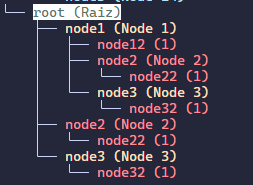

# KAZE 🍁

## Autor:

🐱‍💻 Nicole Bernal 
🐱‍💻 Lina Rodriguez


## Objetivo

Crear un lenguaje personalizado que permita definir de forma simple, legible y estética diagramas jerarquicos y de flujo con propiedades visuales personalizadas.

Este lenguaje será interpretado o compilado usando un sistema propio desarrollado en typescript, utilizando **AFD** para el anáisis léxico, **Autómatas pila (AP)** para el análisis sintáctico **(MT)** Interpretación.

## Componentes

### 1. Tipos de diagramas

* Jerarquico (arbol) comineza con un nodo principal y puede tener nodos hijos.
* Luego se extiende a flujo, red de nodos.

## Sintaxis del lenguaje

````s
    root {
        label: "Raiz",
        child: node1,
        child: node2,
        child: node3,
        color: #baffc9,
        bgcolor: "#ffffff"
      };
      node1 {
        label: "Node 1",
        child: node12
        child: node2,
        child: node3,
        color: #ffdfba
      }
      node2 {
        label: "Node 2",
        child: node22,
        color: #ff8b94
      }
      node3 {
        label: "Node 3",
        child: node32,
        color: #ffdfba
      }
      node12 { label:"1", color:#ff8b94};
      node22 { label:"1", color:#ff8b94 };
      node32 { label:"1", color: #ff8b94 };
````

output:



## To do

cli
    
    input: kaze file
    output: png/svg diagram

web editor
    
    input: kaze code
    output: web visualization
